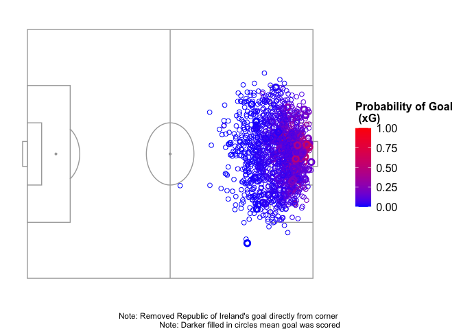

# Expected Goals Model for 2023 WWC
Hope Donoghue

Which area on the soccer field has the highest probability of a goal
occurring? This project explores this question along with many others
related to goal probabilities in soccer. For this project, I built an
expected goals model for the 2023 Women’s World Cup using logistic
regression, and created a variety of visuals like the one shown below.
An expected goals model predicts the probability that a shot will result
in a goal based on the characteristics of that shot and the events
leading up to it. The data that I used for this project comes from
StatsBomb and it is event data. In addition to building the model, I
also built a Shiny App that displays the expected goal probabilities (xG
values) for each shot that a player took in the 2023 Women’s World Cup.
Overall, I found that higher probability shots come from within the 18
yard box and that xG is an effective metric for measuring a player’s
performance.

